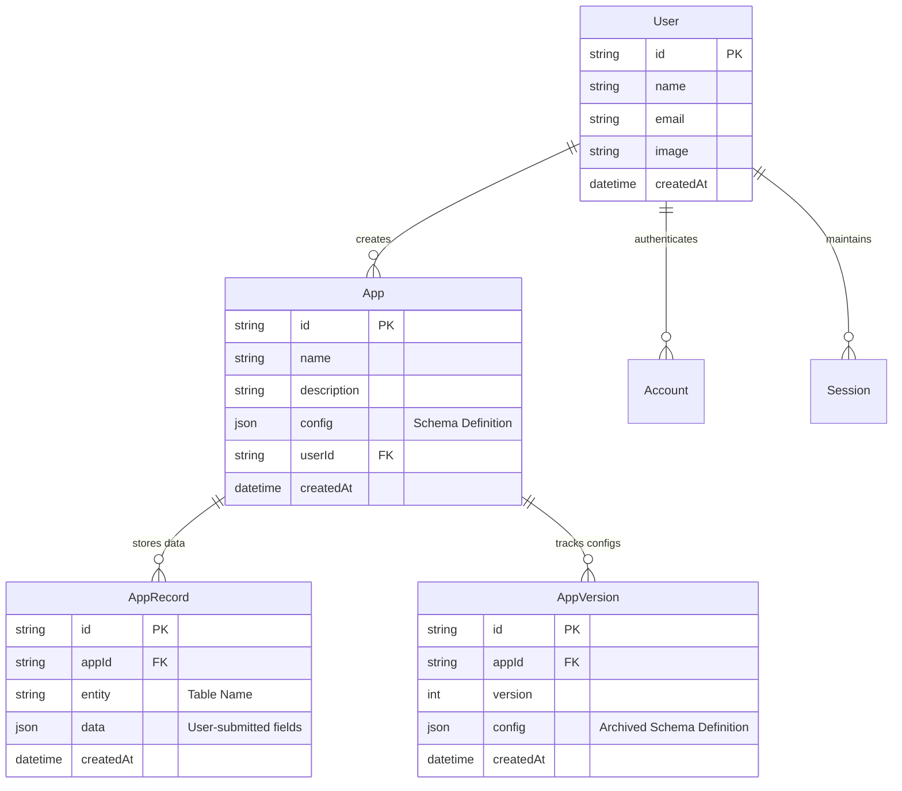

# AppForge 🛠️📊

AppForge is a premium, full-stack, metadata-driven application builder and runtime environment. It allows users to instantly design, validate, preview, and deploy database-backed SaaS products directly from a JSON configuration file. Built using **Next.js 16**, **TypeScript**, **PostgreSQL (via Neon)**, and **Prisma ORM**, AppForge features a custom schema validation playground, automated CSV type inference engines, version rollbacks, and code exporters.

The platform is designed around the sleek, high-end **Sparkline/base44** aesthetic, featuring clean light-gray grid layouts, elegant pill-shaped navigation, custom 3D orbiting illustrations, and fluid micro-animations.

---

## 🚀 Key Features & Core Engines

### 1. ⚡ Dynamic Metadata CRUD Engine
* **Schema-Driven UI**: AppForge compiles a JSON schema definition into a fully interactive user interface with real-time validation.
* **Smart Input Rendering**: Renders custom UI controls according to column data types (e.g., custom toggle switches for booleans, inline date-pickers for dates, and styled dropdown selectors for enums).
* **Automatic Validation**: Submissions are dynamically checked against defined data types, constraints, and custom rules before saving to PostgreSQL.

### 2. 🛡️ Config Validator & Sanitation Playground
* **Sanitation Sandbox**: A standalone playground page (`/playground`) featuring a custom schema sanitation pipeline.
* **Interactive Presets**: Includes 8 preset malformed/broken JSON examples (missing properties, invalid fields, duplicate column keys, non-JSON formats).
* **Real-time Diagnostics**: Runs validation routines and returns a side-by-side display of warnings, fatal errors, and the cleaned, normalized JSON output.

### 3. 📂 CSV Type Inference & Bulk Insert Engine
* **Drag-and-Drop Upload**: Instantly upload any tabular CSV files via the `/import` route.
* **Automatic Reverse Engineering**: The engine samples rows to automatically deduce columns, types (e.g., date, boolean, number, string), and unique enum options.
* **Grid Mapping & Preview**: Displays a beautiful data grid mapping view. Users can verify inferred schemas and adjust column names or types before creating the database schema.
* **Transactional Bulk Insert**: Inserts thousands of rows in a single batch-based Prisma transaction.

### 4. 🔄 Schema Versioning & Safe Rollbacks
* **Config History Log**: Every schema modification creates a versioned snapshot of the application config.
* **Split-Panel Comparison**: View old config definitions side-by-side with current schema states.
* **One-Click Restore**: Revert the entire database-backed UI runtime to any historical configuration without losing existing record data.

### 5. 🐙 Standalone GitHub Exporter
* **Secure Client-Side Packaging**: Creates an external standalone Next.js code repository containing seed data, database configurations, and custom CRUD views.
* **One-Click Vercel Deploy**: Instantly generates an Octokit-powered repository and provides a preconfigured deployment link for Vercel.

---

## 📐 Architecture & Database Schema

AppForge uses a highly normalized schema to run arbitrary user applications on top of a single shared database structure.



---

## 🛠️ Technology Stack & Dependencies

* **Framework**: [Next.js 16 (App Router)](https://nextjs.org/)
* **Language**: [TypeScript](https://www.typescriptlang.org/)
* **Styling**: Vanilla CSS (Tailored variables, grid-bg patterns, keyframe micro-animations, Outfit displaying sans font)
* **ORM**: [Prisma Client & Migrate](https://www.prisma.io/)
* **Database**: [Neon Serverless PostgreSQL](https://neon.tech/)
* **Authentication**: [NextAuth.js (v4)](https://next-auth.js.org/)
* **API Utilities**: `@octokit/rest` (GitHub client), `papaparse` (CSV Parser)

---

## ⚙️ Local Development Setup

### 1. Clone & Install Dependencies
```bash
git clone https://github.com/THISHA-SAMPATH/AppForge.git
cd AppForge
npm install
```

### 2. Configure Environment Variables
Create a `.env` file in the root directory and add the following keys:
```env
DATABASE_URL="postgresql://<username>:<password>@<neon-host>/neondb?sslmode=require"

# NextAuth configuration
NEXTAUTH_URL="http://localhost:3000"
NEXTAUTH_SECRET="your-development-secret-key"

# OAuth Credentials
GOOGLE_CLIENT_ID="your-google-client-id"
GOOGLE_CLIENT_SECRET="your-google-client-secret"
GITHUB_CLIENT_ID="your-github-client-id"
GITHUB_CLIENT_SECRET="your-github-client-secret"
```

### 3. Setup Database Schema
Run migrations to set up the database structure on your Neon instance:
```bash
npx prisma db push
```

### 4. Run Development Server
```bash
npm run dev
```
Open [http://localhost:3000](http://localhost:3000) in your browser.

---

## 🚀 Deployment to Vercel

1. Push your code to your GitHub repository.
2. Sign in to [Vercel](https://vercel.com/) and click **Add New** ➡️ **Project**.
3. Select your `AppForge` repository.
4. Configure the environment variables in Vercel to match your production Neon Database credentials.
5. Click **Deploy**. Vercel will build and launch your application automatically.


