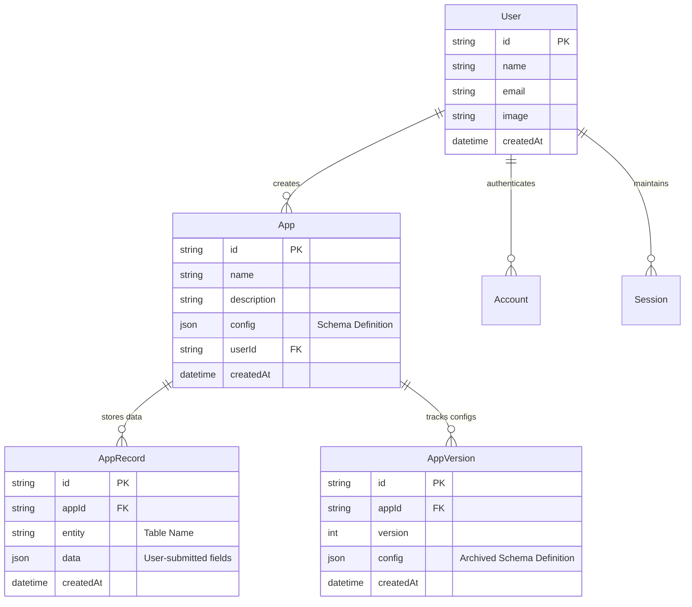

# AppForge 🛠️

> Instantly design, validate, preview, and deploy database-backed SaaS products from a JSON config file.

[](https://nextjs.org)
[](https://typescriptlang.org)
[](https://postgresql.org)
[](https://prisma.io)
[](https://next-auth.js.org)

🔗 **[Live Demo](https://app-forge-ten.vercel.app/)**

---

AppForge is a premium, full-stack, metadata-driven application builder and runtime environment. It allows users to instantly design, validate, preview, and deploy database-backed SaaS products directly from a JSON configuration file. Built using **Next.js 16**, **TypeScript**, **PostgreSQL (via Neon)**, and **Prisma ORM**, AppForge features a custom schema validation playground, automated CSV type inference engines, version rollbacks, and code exporters.

The platform is designed around a sleek, high-end **Sparkline/base44** aesthetic, featuring clean light-gray grid layouts, elegant pill-shaped navigation, custom 3D orbiting illustrations, and fluid micro-animations.

---

## 🚀 Key Features & Core Engines

### 1. ⚡ Dynamic Metadata CRUD Engine
* **Schema-Driven UI**: AppForge compiles a JSON schema definition into a fully interactive user interface with real-time validation.
* **Smart Input Rendering**: Renders custom UI controls according to column data types (e.g., custom toggle switches for booleans, inline date-pickers for dates, and styled dropdown selectors for enums).
* **Automatic Validation**: Submissions are dynamically checked against defined data types, constraints, and custom rules before saving to PostgreSQL.

### 2. 📱 Local Network PWA & "Deploy to Phone"
* **Primary IP Resolution API**: Uses a custom server-side utility (`/api/local-ip`) that reads active network interfaces and resolves the host machine's primary local network IPv4 address (e.g., `192.168.X.X`).
* **Dynamic QR-Code Generator**: Replaces `localhost` dynamically with the server's local IP on the deployment preview sheet, allowing any mobile device on the same Wi-Fi to scan the QR code.
* **Instant PWA Installation**: Mobile users can view the dynamic web app prototype in real-time and install it as a progressive web application directly on their phones.

### 3. 🛡️ Config Validator & Sanitation Playground
* **Sanitation Sandbox**: A standalone playground page (`/playground`) featuring a custom schema sanitation pipeline.
* **Interactive Presets**: Includes 8 preset malformed/broken JSON examples (missing properties, invalid fields, duplicate column keys, non-JSON formats).
* **Real-time Diagnostics**: Runs validation routines and returns a side-by-side display of warnings, fatal errors, and the cleaned, normalized JSON output.

### 4. 📂 CSV Type Inference & Bulk Insert Engine
* **Drag-and-Drop Upload**: Instantly upload any tabular CSV files via the `/import` route.
* **Automatic Reverse Engineering**: The engine samples rows to automatically deduce columns, types (e.g., date, boolean, number, string), and unique enum options.
* **Grid Mapping & Preview**: Displays a data grid mapping view — verify inferred schemas and adjust column names or types before creating the database schema.
* **Transactional Bulk Insert**: Inserts thousands of rows in a single batch-based Prisma transaction.

### 5. 🔄 Schema Versioning & Safe Rollbacks
* **Config History Log**: Every schema modification creates a versioned snapshot of the application config.
* **Split-Panel Comparison**: View old config definitions side-by-side with current schema states.
* **One-Click Restore**: Revert the entire database-backed UI runtime to any historical configuration without losing existing record data.

### 6. 🐙 Standalone GitHub Exporter
* **Secure Client-Side Packaging**: Creates an external standalone Next.js code repository containing seed data, database configurations, and custom CRUD views.
* **One-Click Vercel Deploy**: Instantly generates an Octokit-powered repository and provides a preconfigured deployment link for Vercel.

### 7. 🎨 Premium Landing & Login Showcase
* **Responsive Scrolling Fold**: Smooth page-scrolling to explore platform capabilities without interfering with the OAuth authentication card.
* **Sleek Side-Spread 3D Graphics**: Orbiting 3D isometric cards float on the outer left and right margins to frame the landing fold layout.
* **Interactive Feature Walkthrough**: Centers a custom-designed timeline map, a 2×2 grid highlighting AppForge advantages, and an animated scroll assistant.

---

## 📐 Architecture & Database Schema

AppForge uses a highly normalized schema to run arbitrary user applications on top of a single shared database structure.

> Design decision: JSON blob storage was chosen over dynamic Prisma migrations because runtime schema generation is unsafe at this scope.



---

## 🛠️ Tech Stack

| Layer | Technology |
|-------|-----------|
| **Framework** | Next.js 16 (App Router) |
| **Language** | TypeScript |
| **Styling** | Vanilla CSS (custom variables, grid-bg patterns, keyframe animations) |
| **ORM** | Prisma Client & Migrate |
| **Database** | Neon Serverless PostgreSQL |
| **Auth** | NextAuth.js v5 Beta (Google + GitHub OAuth) |
| **API Utilities** | `@octokit/rest` (GitHub client), `papaparse` (CSV parser) |

---

## ⚙️ Local Development Setup

### 1. Clone & Install
```bash
git clone https://github.com/THISHA-SAMPATH/AppForge.git
cd AppForge
npm install
```

### 2. Configure Environment Variables
```env
DATABASE_URL="postgresql://<username>:<password>@<neon-host>/neondb?sslmode=require"

NEXTAUTH_URL="http://localhost:3000"
NEXTAUTH_SECRET="your-development-secret-key"

GOOGLE_CLIENT_ID="your-google-client-id"
GOOGLE_CLIENT_SECRET="your-google-client-secret"
GITHUB_CLIENT_ID="your-github-client-id"
GITHUB_CLIENT_SECRET="your-github-client-secret"
```

### 3. Setup Database
```bash
npx prisma db push
```

### 4. Run Dev Server
```bash
npm run dev
```

Open [http://localhost:3000](http://localhost:3000) or connect mobile devices on the same Wi-Fi using the network IP shown in the console.

---

## 🚀 Deployment to Vercel

1. Push your code to GitHub
2. Go to [vercel.com](https://vercel.com) → **Add New → Project**
3. Select the `AppForge` repository
4. Add all environment variables from your `.env` file
5. Click **Deploy**

---

## 📄 License

MIT License — see [LICENSE](LICENSE) for details.

---

<div align="center">

Built by [Thisha Sampath](https://github.com/THISHA-SAMPATH) · VIT Chennai · 2024–28

</div>
